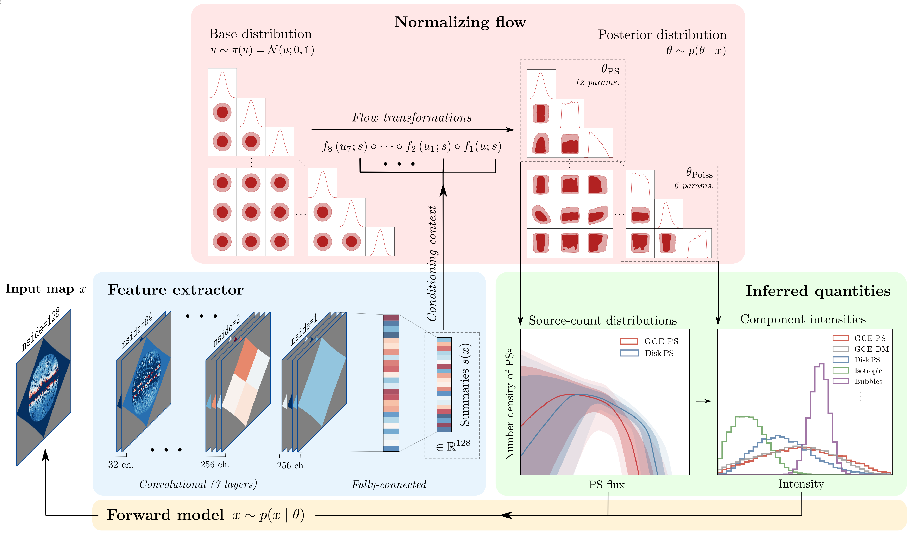

# Simulation-based inference for the Galactic Center Excess

[Siddharth Mishra-Sharma](smsharma@mit.edu) and [Kyle Cranmer](kyle.cranmer@nyu.edu)

[](https://www.gnu.org/licenses/agpl-3.0)
[](https://arxiv.org/abs/2110.06931)



## Abstract

The nature of the _Fermi_ gamma-ray Galactic Center Excess (GCE) has remained a persistent mystery for over a decade. Although the excess is broadly compatible with emission expected due to dark matter annihilation, an explanation in terms of a population of unresolved astrophysical point sources e.g., millisecond pulsars, remains viable. The effort to uncover the origin of the GCE is hampered in particular by an incomplete understanding of diffuse emission of Galactic origin. This can lead to spurious features that make it difficult to robustly differentiate smooth emission, as expected for a dark matter origin, from more "clumpy" emission expected for a population of relatively bright, unresolved point sources. We use recent advancements in the field of simulation-based inference, in particular density estimation techniques using normalizing flows, in order to characterize the contribution of modeled components, including unresolved point sources, to the GCE. Compared to traditional techniques based on the statistical distribution of photon counts, our machine learning-based method is able to utilize more of the information contained in a given model of the Galactic Center emission, and in particular can perform posterior parameter estimation while accounting for pixel-to-pixel spatial correlations in the gamma-ray map. On application to _Fermi_ data, the method generically attributes a smaller fraction of the GCE flux to unresolved point source-like emission when compared to traditional approaches. We nevertheless infer such a contribution to make up a non-negligible fraction of the GCE across all analysis variations considered, with at least 38<sup>+9</sup><sub>-19</sub>% of the excess being consistent with a point source origin in our baseline analysis.

## Code

Dependencies are given in [environment.yml](environment.yml).

- [simulate.py](simulate.py) produces simulated maps for training. In the [scripts](scripts/) folder, `sbatch --array=0-999 simulate.sh` parallelizes sample generation in a SLURM HPC environment.
- [combine_samples.py](combine_samples.py) combines the generated samples into single files in order to use them for training. [scripts/combine_samples.sh](scripts/combine_samples.sh) submits this as a SLURM job.
- [train.py](train.py) trains the model. Experiments are managed using `MLflow'. [scripts/submit_train.py](scripts/submit_train.py) can loop over a grid of analysis configurations and submit a SLURM script for each; see options in [train.py](train.py).
- [nptfit.py](nptfit.py) runs a NPTF fit, requiring `NPTFit` to be installed. [scripts/submit_nptfit.py](scripts/submit_nptfit.py) submits SLURM scripts for the different configurations explored in the paper.

### Using the pre-trained model

- The notebook [notebooks/02_00_analysis_minimal.ipynb](notebooks/02_00_analysis_minimal.ipynb) shows a minimal example of loading the pre-trained model included in this repository, drawing samples from it, and reproducing the baseline analysis on _Fermi_ data using the plotting scripts in [utils/plotting.py](utils/plotting.py).

## Citation

```
@article{Mishra-Sharma:2021abc,
      author         = "Mishra-Sharma, Siddharth and Cranmer, Kyle",
      title          = "{A neural simulation-based inference approach for characterizing the Galactic Center $\gamma$-ray excess}",
      year           = "2021",
      eprint         = "2110.06931",
      archivePrefix  = "arXiv",
      primaryClass   = "astro-ph.HE",
      SLACcitation   = "%%CITATION = ARXIV:2110.06931;%%"
}
```

The repository contains 
- Code that is part of [sbi](https://github.com/mackelab/sbi) for inference,
- [Code](https://github.com/smsharma/mining-for-substructure-lens) associated with [1909.02005](https://arxiv.org/abs/1909.02005) for scripting and data processing, 
- Code that is part of [NPTFit-Sim](https://github.com/nickrodd/NPTFit-Sim) for forward modeling, and
- [Code](https://github.com/deepsphere/deepsphere-pytorch) associated with [2012.15000](https://arxiv.org/abs/2012.15000) for constructing the feature extractor network.